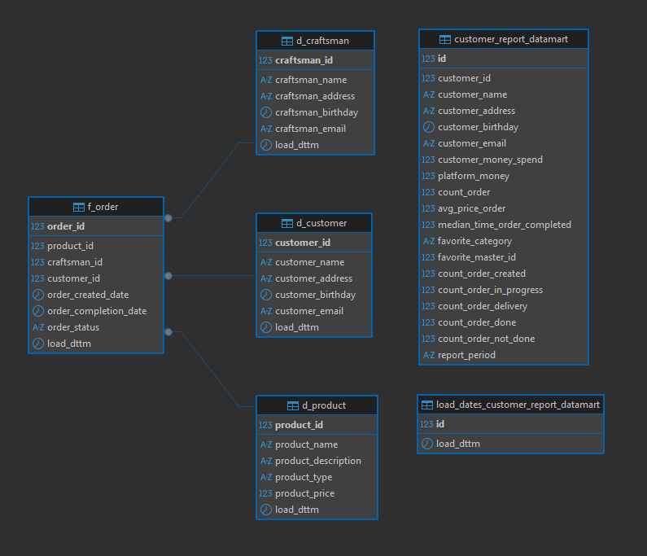
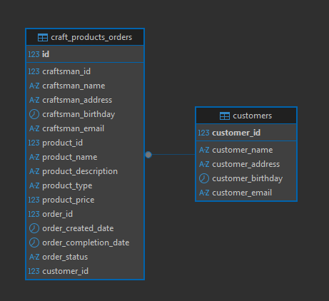

# Adding a new source to DWH

## Project Overview
Adds a new data source, implements incremental loading of data for the dwh_customer_report_datamart view

## Final ER-model

  

## Description of scripts
**All scripts:**
- `DDL_dwh_customer_report_datamart.sql`
- `DDL_dwh_load_dates_customer_report_datamart.sql`
- `DML_load_from_old_sources.sql`
- `DML_updating_showcase_by_customers.sql`

### DDL_dwh_customer_report_datamart
Creating a showcase for the data needed by the business

### DDL_dwh_load_dates_customer_report_datamart
Creating a table for storing data upload dates in the view

### DML_load_from_old_sources
A script for uploading data from sources to temporary tables with subsequent uploading to dim and fact tables

### DML_updating_showcase_by_customers
Script for incremental loading of data from fact and dim tables into the view

## External Source

  

## What to include in this repo
- SQL scripts in `/scripts`
- Screenshots in `/screenshots`